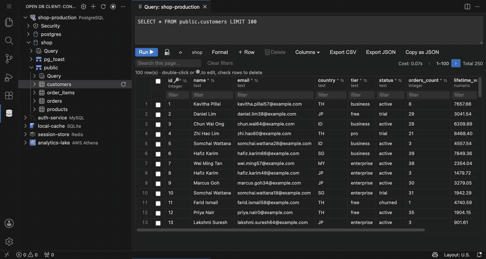
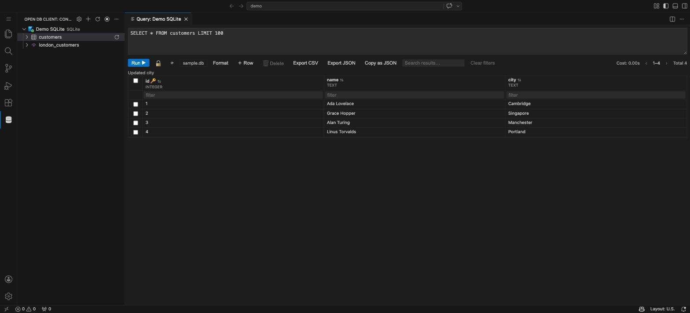
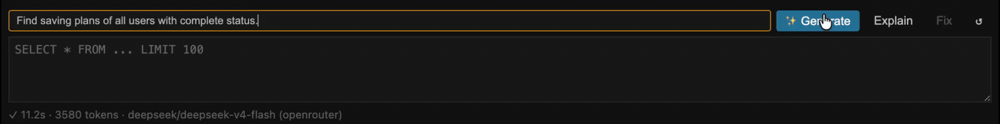
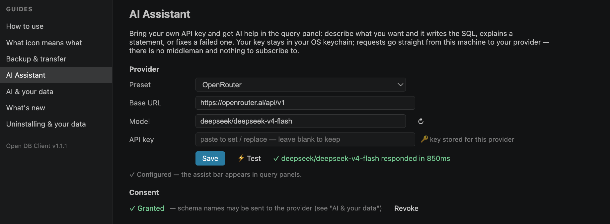
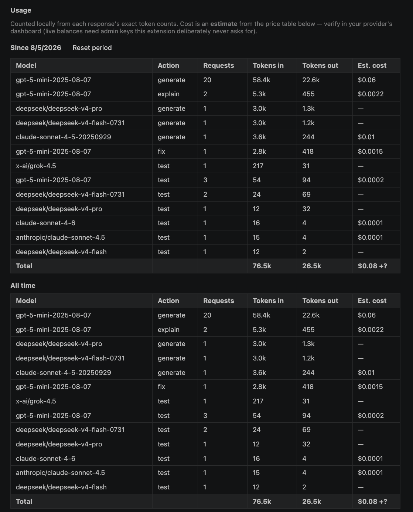

# Open DB Client

**A free, lightweight database client for VS Code — with unlimited connections.**
No license, no account, no paywall, no "premium" tier. One tree for
**PostgreSQL, MySQL/MariaDB, SQLite, and Redis**, side by side.

Built on mature, pure-JS drivers (`pg`, `mysql2`, `ioredis`) plus WASM `sql.js` —
**no native build step**, so nothing breaks after a VS Code update.

## Why this one?

- **Unlimited connections, forever free.** Most popular DB extensions cap you at
  2–3 connections unless you pay. This one never will.
- **Edit data where you see it.** The results grid is writable — update cells,
  insert and delete rows — not just a read-only viewer.
- **Four engines, one workflow.** The same tree, query panel, and shortcuts
  work identically for Postgres, MySQL/MariaDB, SQLite, and Redis.
- **Your secrets stay secret.** Passwords live in your OS keychain via VS Code
  SecretStorage — never in settings files or plain text.
- **AI on your terms.** Generate, explain, and fix SQL with your own API key
  and any OpenAI-compatible provider — no subscription, no data middleman,
  and a local ledger showing exactly what each request cost.

## Features

### Query & edit

- **Query panel** with SQL formatting, line-comment toggle (`Ctrl/Cmd+/`), and
  **highlight-to-run** — select a statement and run just that.
- **Editable results grid** — update cells, insert and delete rows
  (primary-key based), with SQLite changes written back to the `.db` file.
- **Export results** to file straight from the grid.
- **Saved queries** — organize `.sql` files in folders right in the tree, and
  run them against any connection.

### AI assistant — bring your own key

- Describe what you want in plain language and **Generate** the SQL, ask it to
  **Explain** a statement, or **Fix** a failed one — right in the query panel.
- Works with any OpenAI-compatible endpoint (OpenAI, OpenRouter, DeepSeek,
  local models…) — your key, your model, your choice.
- Your key stays in your OS keychain; requests go straight from your machine
  to your provider. **No middleman, nothing to subscribe to.**
- A **local usage ledger** counts every request's exact tokens and estimated
  cost — measured on your machine, not promised by us.
- Safety built in: when the AI generates a mutation (UPDATE, DELETE, …) the
  panel **auto-locks** so nothing runs until you review and unlock.

### Browse & inspect

- Browse servers → databases → schemas → tables/views, with live
  **table search** on long lists.
- **View DDL / structure** for any table or view.
- Click a table to preview the top 200 rows instantly.

### Redis, first-class

- Browse and **search keys server-side**, view values, delete keys, and
  set/clear TTLs — plus run raw commands (`GET foo`) in the query panel.

### Connect from anywhere

- **SSH tunnels** — reach databases behind a bastion host, with key or
  password auth.
- **Connection strings** supported alongside the form.
- **Import / export connections** — move your whole setup between machines.
  Three flavors, safest first: without passwords, passphrase-encrypted
  (AES-256-GCM), or plain text behind an explicit warning that counts exactly
  what's about to be written.

## Getting started

1. Install: search **"Open DB Client"** in the Extensions view
   (`Ctrl/Cmd+Shift+X`), or `ext install brianlab.open-database-client`.
2. Click **＋ Add Connection** in the panel title bar.
3. Pick an engine, fill host/port/user/password (or a file path for SQLite) —
   or paste a connection string.
4. Expand the connection to browse schemas → tables (or keys, for Redis).
5. Right-click a connection → **New Query** to run arbitrary SQL or Redis
   commands.

The **Settings & Guides** panel (gear icon in the panel title bar) has
engine-specific walkthroughs.

## Security

- Passwords and SSH secrets are stored in **VS Code SecretStorage** (your OS
  keychain) — never in settings files or plain text.
- Connection exports that contain credentials are encrypted with a passphrase
  you choose (scrypt + AES-256-GCM), or clearly marked and confirmed when you
  explicitly choose plain text.

## Notes & limits

- Table previews are capped at 200 rows and Redis key listings at 500 per
  page — the UI always tells you when a list is truncated.
- Grid editing needs a primary key on the table; rows without one are
  read-only.

Found a bug or missing a feature? Issues and PRs are welcome on
[GitHub](https://github.com/BrianYam/vscode-db-client) — see
[DEVELOPMENT.md](https://github.com/BrianYam/vscode-db-client/blob/main/DEVELOPMENT.md)
for how to build and run from source. Release history is in the
[changelog](CHANGELOG.md).
